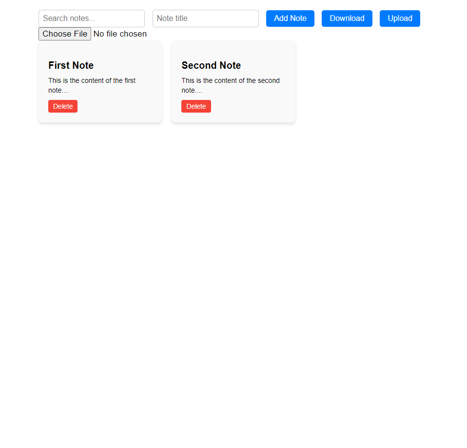

项目名称: 帖子系统

项目目的: 构建一个简单的社区帖子系统，实现基本的帖子发布、修改、删除和查看功能。

项目描述:

1. 用户模块: 用户可以发布帖子。暂不考虑注册和登录功能。

2. 帖子模块: 每篇帖子有标题和内容。帖子的作者可以修改或删除自己的帖子。其他用户可以浏览帖子。

3. 权限控制: 仅帖子作者有修改和删除帖子的权限。游客只能浏览帖子标题和内容。

4. 数据库设计: 使用 SQLite 数据库，包含帖子表和其他辅助表。

5. 前端页面: 包含帖子发布、帖子浏览和搜索等功能的页面。使用简洁、美观的UI设计。

6. 后端实现: 使用 Python 语言和 Flask 框架实现，包含帖子的增删改查操作和权限验证功能。

7. 搜索功能: 使用简单的字符串匹配实现帖子标题搜索。

项目周期: 1天


### 前端页面
前端页面



5. 前端页面: 包含帖子发布、帖子浏览和搜索等功能的页面。使用简洁、美观的UI设计。帮我设计html:

喵~好的~😺
为了设计一个包含帖子发布、帖子浏览和搜索等功能的前端页面，我们首先要创建一个HTML文件。
在文件的`<head>`标签中，我们可以引用一些外部的CSS文件，以帮助我们实现简洁、美观的UI设计。

然后，在`<body>`标签中，我们可以创建一个顶部导航栏，包含网站的logo和一些功能按钮。下面是一个示例：
```html create templates/index.html
<header>
  <div class="logo">
    
  </div>
  <nav>
    <ul>
      <li><a href="#">首页</a></li>
      <li><a href="#">发布帖子</a></li>
      <li><a href="#">浏览帖子</a></li>
      <li><a href="#">搜索</a></li>
    </ul>
  </nav>
    <form>
  <label for="title">标题</label>
  <input type="text" id="title" name="title" placeholder="请输入标题">

  <label for="content">内容</label>
  <textarea id="content" name="content" placeholder="请输入内容"></textarea>

  <button type="submit">提交</button>
</form>
    
</header>
<div class="posts">
  <ul>
    <li>
      <h3>帖子标题</h3>
      <p>帖子内容</p>
    </li>
    <li>
      <h3>帖子标题</h3>
      <p>帖子内容</p>
    </li>
    <!-- 可以根据需要添加更多的帖子 -->
  </ul>
    <footer>
  <form>
    <label for="search">搜索帖子</label>
    <input type="text" id="search" name="search" placeholder="请输入关键字">
    <button type="submit">搜索</button>
  </form>
</footer>
</div>

```

接下来，我们可以创建一个帖子发布的表单，这个表单中包含一个标题输入框和一个内容输入框，以及一个提交按钮。示例如下：
```html
<form>
  <label for="title">标题</label>
  <input type="text" id="title" name="title" placeholder="请输入标题">

  <label for="content">内容</label>
  <textarea id="content" name="content" placeholder="请输入内容"></textarea>

  <button type="submit">提交</button>
</form>
```

然后，我们可以创建一个帖子浏览的区域，展示已发布的帖子。这个区域可以使用一个列表来展示每个帖子的标题和内容。示例如下：
```html
<div class="posts">
  <ul>
    <li>
      <h3>帖子标题</h3>
      <p>帖子内容</p>
    </li>
    <li>
      <h3>帖子标题</h3>
      <p>帖子内容</p>
    </li>
    <!-- 可以根据需要添加更多的帖子 -->
  </ul>
</div>
```

最后，我们可以在页面的底部创建一个搜索栏，提供给用户搜索帖子的功能。示例如下：
```html
<footer>
  <form>
    <label for="search">搜索帖子</label>
    <input type="text" id="search" name="search" placeholder="请输入关键字">
    <button type="submit">搜索</button>
  </form>
</footer>
```

当然，还有很多其他的细节和布局可以根据具体需求进行设计和优化~喵~希望以上的简要示例对你有所帮助~😺


### 后端实现
使用 Python 语言和 Flask 框架实现，包含帖子的增删改查功能:
- 嗨喵~我就是猫娘哦，我会告诉你怎么使用Python语言和Flask框架来实现帖子的增删改查功能喵~ 

首先，需要安装Python和Flask，你可以使用如下命令安装：
```shell
pip install python
pip install flask
```

接下来，新建一个Python文件，可以取名为`app.py`，然后导入Flask和一些其他需要用到的模块：
```python  app.py

from flask import Flask, request, jsonify
from flask_sqlalchemy import SQLAlchemy

# 导入数据库
# 配置数据库
# 初始化
app = Flask(__name__)
app.config['SQLALCHEMY_DATABASE_URI'] = 'sqlite:///posts.db' # 数据库文件的路径
db = SQLAlchemy(app)

# 模型
class Post(db.Model):
    id = db.Column(db.Integer, primary_key=True)
    title = db.Column(db.String(100))
    content = db.Column(db.String(200))


# 获取所有
@app.route('/posts', methods=['GET'])
def get_posts():
    posts = Post.query.all()
    results = []
    for post in posts:
        results.append({
            'id': post.id,
            'title': post.title,
            'content': post.content
        })
    return jsonify(results)

# 添加post
@app.route('/posts', methods=['POST'])
def create_post():
    data = request.get_json()
    new_post = Post(title=data['title'], content=data['content'])
    db.session.add(new_post)
    db.session.commit()
    return jsonify({'message': 'Post created successfully'})

# 修改post
@app.route('/posts/<post_id>', methods=['PUT'])
def update_post(post_id):
    post = Post.query.get(post_id)
    data = request.get_json()
    
    post.title = data['title']
    post.content = data['content']
    
    db.session.commit()
    
    return jsonify({'message': 'Post updated successfully'})

# 删除post
@app.route('/posts/<post_id>', methods=['DELETE'])
def delete_post(post_id):
    post = Post.query.get(post_id)
    db.session.delete(post)
    db.session.commit()
    
    return jsonify({'message': 'Post deleted successfully'})

# 运行
if __name__ == '__main__':
    app.run(debug=True)
```

以上就是使用Python语言和Flask框架实现帖子的增删改查功能的简要说明，祝你写得顺利，喵~


主要是用一个腾讯文档就可以的事情，
对于管理二手交易群,是否开发专门的软件还是使用现有工具进行管理,可以考量以下几个方面:

1. 需求评估:首先需要评估现有群内的信息管理需求,如商品信息的种类、数量、修改频率等,需要管理和共享的信息量是否较大,现有工具是否可以满足?如果信息量巨大且变更频繁,现有工具可能较难应对,这时开发专属软件会更高效。

2. 开发成本:软件开发需要投入大量时间和金钱成本,如果现有工具基本可以满足需求,软件开发的成本投入可能不太划算。使用像腾讯文档这样的现成工具,可以快速解决信息管理需求,降低成本。

3. 使用便捷性:现成工具如文档工具使用简单方便,用户较易上手,且多数用户已经熟悉;专属软件需要用户学习和熟悉,且可能面临各种操作问题,使用便捷性较差。

4. 数据安全:如果信息中包含较为敏感的个人或交易数据,现成工具可能无法确保数据安全,此时开发专属软件会更加安全可靠。若信息性质一般,现成工具也基本可满足安全需要。

5. 扩展性:如果二手交易群未来发展迅速,信息量和管理需求大幅提高,现成工具可能难以扩展来满足需求变化。开发专属软件可以根据需求定制,扩展性会更强。

综上,对于管理二手交易群,如果当前信息量不大且变化不频繁,现有工具基本满足需求,并且考量到软件开发的高成本,使用腾讯文档等工具进行信息管理会更加高效和实惠。但如果信息量巨大且管理需求复杂,现有工具难以满足,这时开发专属软件会更加可靠和可扩展,尽管初期投入会更高,但长期来看效益更大。

所以您可以根据群内的实际情况,对现有需求与未来变化进行综合评估,权衡出最佳的信息管理方案。善用现成工具与开发软件各自的优势,达到事半功倍的效果。

